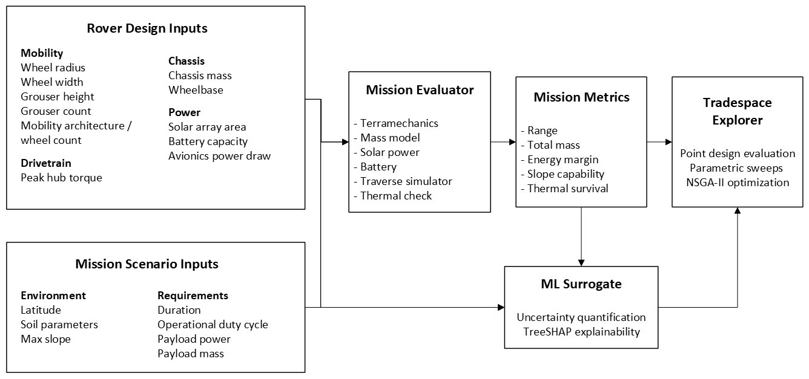

# RoverDevKit

**Design-space exploration for lunar micro-rovers.**

[](https://arxiv.org/abs/2606.21755)

RoverDevKit is an open-source research toolkit for early-stage lunar
micro-rover design. It combines a physics-based mission evaluator,
calibrated surrogate models, and an
interactive web app for exploring mobility, power, mass, and mission tradeoffs.

The tool is aimed at supporting conceptual design questions such as:

- How do wheel geometry, solar area, battery capacity, drivetrain torque, and
  chassis mass trade against each other for a given lunar mission, given a fixed
  scientific payload mass and power requirement?
- Which candidate designs are Pareto-efficient for range, slope capability,
  energy margin, and total mass?
- For a given candidate design, what features contribute most to its predicted values
  for range, mass, and slope capability?
- How do candidate designs compare with historical and published lunar micro-rover designs?

## What RoverDevKit Provides



- **Mission evaluator:** deterministic end-to-end evaluation of a rover design
  in a lunar mission scenario, returning range, energy margin, slope capability,
  total mass, thermal survival, and drivetrain stall diagnostics. Scientific
  payload (instrument mass and continuous power) is treated as a mission
  *requirement* set alongside the scenario, not as a design variable the
  engineer trades; the chassis-mass input is the structural chassis only. It
  couples several physics sub-models:
  - **Terramechanics:** Bekker-Wong wheel-soil mechanics with an
    engaged-grouser shear-thrust term.
  - **Drivetrain:** motor torque, stall, and cruise-speed limits.
  - **Power:** solar generation, battery storage, and thermal survival.
  - **Mass:** parametric mass-estimating relationships for the rover subsystems.
- **Surrogate + uncertainty:** quantile XGBoost models trained on the LHS
  corpus that provide fast, calibrated 90% prediction intervals around the
  evaluator outputs — the layer that makes interactive Current Design
  predictions practical without re-running the full physics stack on every
  slider move.
- **Multi-objective design optimization:** NSGA-II searches over the design
  variables with the physics evaluator as the objective function, producing
  Pareto fronts for range, slope capability, energy margin, and total mass.
- **Design explanations:** TreeSHAP feature attributions on the surrogate
  models, showing which design inputs drive predicted range, mass, slope
  capability, and energy margin for a candidate design.
- **Interactive web app:** browser interface for current-design analysis,
  parametric sweeps, optimization, and explanations.
- **Validation data and registry:** published lunar micro-rover design points,
  mission scenarios, soil simulants, and validation harnesses.

## Web App

The browser app is the easiest way to use RoverDevKit.

Tabs in the app:

- **Current Design:** set the mission inputs (scenario, scientific-payload mass
  and power, operational duty cycle), edit a rover design, and view predicted
  performance with calibrated 90% intervals.
- **Parametric Sweep:** vary one or two design variables and visualize how an
  output changes across the design space.
- **Optimize Design:** run multi-objective NSGA-II searches and inspect the
  resulting tradeoff front.
- **Explain Design:** show SHAP-style feature attributions for the active
  design and selected output.

### Run with Docker (one command)

The fastest way to try the tool is the multi-stage container — it bakes
in the surrogate and the canonical Pareto fronts, then serves backend + SPA
from a single `uvicorn` process.

```bash
docker compose -f webapp/docker-compose.yml up --build
```

Open <http://localhost:8000>. See [`webapp/README.md`](webapp/README.md)
for the hosted-demo readiness checklist (Hugging Face Spaces / Fly.io /
Duke container) and the env-var surface.

### Run from a Python environment (live reload)

```bash
# 1. Create and activate the Python environment.
mamba env create -f environment.yml
conda activate roverdevkit
pip install -e ".[dev,webapp]"

# 2. Install frontend dependencies.
cd webapp/frontend
npm install
cd ../..

# 3. Start backend and frontend together.
make webapp-dev
```

Open <http://localhost:5173>.

The FastAPI backend runs on <http://localhost:8000>, with OpenAPI docs at
<http://localhost:8000/docs>.

## Python Quickstart

You can also use the evaluator directly from Python:

```python
from roverdevkit.mission.evaluator import evaluate
from roverdevkit.mission.scenarios import load_scenario
from roverdevkit.schema import DesignVector

design = DesignVector(
    wheel_radius_m=0.10,
    wheel_width_m=0.10,
    grouser_height_m=0.012,
    grouser_count=14,
    n_wheels=6,
    chassis_mass_kg=20.0,
    wheelbase_m=0.60,
    solar_area_m2=0.50,
    battery_capacity_wh=100.0,
    avionics_power_w=15.0,
    peak_wheel_torque_nm=1.50,
)

scenario = load_scenario("equatorial_mare_traverse")
metrics = evaluate(design, scenario)

print(metrics.range_km)
print(metrics.energy_margin_raw_pct)
print(metrics.slope_capability_deg)
print(metrics.total_mass_kg)
print(metrics.obstacle_capability_m)
print(metrics.obstacle_margin_m)
```

The design vector trades `mobility_architecture` (`rigid_4wheel` vs.
`rocker_bogie_6wheel`) alongside wheel geometry. Missions may specify
`required_obstacle_height_m` on the scenario; rocker-bogie carries a
suspension mass penalty but negotiates taller obstacles via the
architecture proxy in `roverdevkit/architecture.py`. Run
`make architecture-crossover` to regenerate the manuscript crossover
figure from evaluator-backed NSGA-II sweeps.

## Installation Notes

The recommended setup is **Miniforge/Mambaforge + conda**.

```bash
mamba env create -f environment.yml
conda activate roverdevkit
pip install -e ".[dev,webapp]"
pytest -q
```

The conda environment uses Python 3.12.

The web app expects the trained surrogate bundle at
`models/surrogate_v9/quantile_bundles.joblib` or supplied through the
`ROVERDEVKIT_QUANTILE_BUNDLES` environment variable. The evaluator routes
(current-design evaluation, parametric sweeps, NSGA-II in the Optimize
Design tab) work without it; the surrogate is needed only for the 90%
prediction intervals on the Current Design tab and the SHAP attributions
on the Explain Design tab.

## Repository Layout

```text
roverdevkit/
├── models/               # Shipped trained surrogate bundles (runtime artifacts)
├── data/                 # Soil parameters, analytical data, published rover data
├── roverdevkit/          # Python package
│   ├── drivetrain/       # Motor and cruise-speed helpers
│   ├── mass/             # Parametric mass-estimating relationships
│   ├── mission/          # Scenarios, evaluator, traverse simulator
│   ├── power/            # Solar, battery, thermal models
│   ├── surrogate/        # Features, datasets, baselines, uncertainty
│   ├── terramechanics/   # Bekker-Wong wheel-soil mechanics
│   ├── tradespace/       # Sweeps, NSGA-II optimization, design explanations
│   └── validation/       # Rover registry and validation helpers
├── scripts/              # Dataset, tuning, validation, and report scripts
├── tests/                # Python test suite
└── webapp/               # FastAPI backend and React frontend
```

## Development

```bash
# Python tests
conda run -n roverdevkit pytest

# Backend web tests
conda run -n roverdevkit pytest webapp/backend/tests

# Frontend checks
cd webapp/frontend
npm run lint
npm run build
```

Useful app commands:

```bash
make webapp-dev       # backend on :8000, frontend on :5173
make webapp-backend   # backend only
make webapp-frontend  # frontend only
make webapp-test      # backend tests + frontend lint/build
```

## Reproducibility

Artifacts that back the webapp and the figures in the manuscript
live under `reports/` and are regenerated by these commands:

| Command | Output | Purpose |
| --- | --- | --- |
| `make pareto-fronts` | `reports/pareto_fronts/` | Evaluator-driven NSGA-II Pareto fronts for the four canonical scenarios. Every point is corrected-evaluator output (no surrogate involvement). Reference artifacts for the manuscript figures; the webapp runs its own live NSGA-II on demand. |
| `make optimizer-robustness` | `reports/optimizer_robustness/` | Multi-seed, multi-budget evaluator-backed NSGA-II sweep used to check Pareto-front repeatability and convergence for the manuscript. |
| `make architecture-crossover` | `reports/architecture_obstacle_crossover/` | Sweeps `required_obstacle_height_m` across the four canonical scenarios and records when rocker-bogie six-wheel layouts enter the Pareto set. |
| `python scripts/run_rediscovery_loo.py --all --n-seeds 5` | `reports/rediscovery_loo_evaluator/` | Rediscovery sweep over the six-rover registry (the headline validation result). The `--n-seeds 5` ensemble is the paper configuration; the script default (`--n-seeds 1`) runs a faster single-seed sweep whose per-rover distances are noisier. |
| `make figures` | `paper/figures/` | Renders every manuscript figure (Pareto fronts, rediscovery distance + overlay, flown-rover peak-solar, terramechanics validation, terramechanics sensitivity, architecture crossover) from the artifacts above via the `scripts/make_*_figure.py` regenerators. Runs in well under a minute. |

`make pareto-fronts` runs end-to-end in ~4 minutes on a laptop with the
`roverdevkit` conda environment activated; the rediscovery sweep takes
~10 minutes. With both in place, `make figures`
regenerates the figures into `paper/figures/`.

## Research Background

RoverDevKit is developed by the Autonomous Mission Systems Lab at Duke University.
The project focuses on open, reproducible design-space exploration for lunar
micro-rovers in the pre-Phase A / conceptual-design regime.

## Use of AI Tools

Portions of this repository's code and documentation were developed with the
assistance of an AI coding tool — Anthropic's Claude (Opus 4.8) via the Cursor
IDE — for code generation, refactoring, and documentation drafting. All
AI-assisted contributions were reviewed, tested, and validated by the authors,
who take full responsibility for the correctness of the physics models,
methods, results, and claims presented here. This disclosure is provided in the
interest of research transparency and reproducibility.

## Citation

If you use RoverDevKit in your research, please cite the preprint:
<https://arxiv.org/abs/2606.21755>.

```bibtex
@article{reifschneider2026roverdevkit,
  title={RoverDevKit: An open, physics-grounded tradespace toolkit for conceptual design of lunar micro-rovers},
  author={Reifschneider, Jon},
  year={2026},
  eprint={2606.21755},
  archivePrefix={arXiv},
  primaryClass={cs.RO}
}
```

## License

MIT — see [`LICENSE`](LICENSE).
